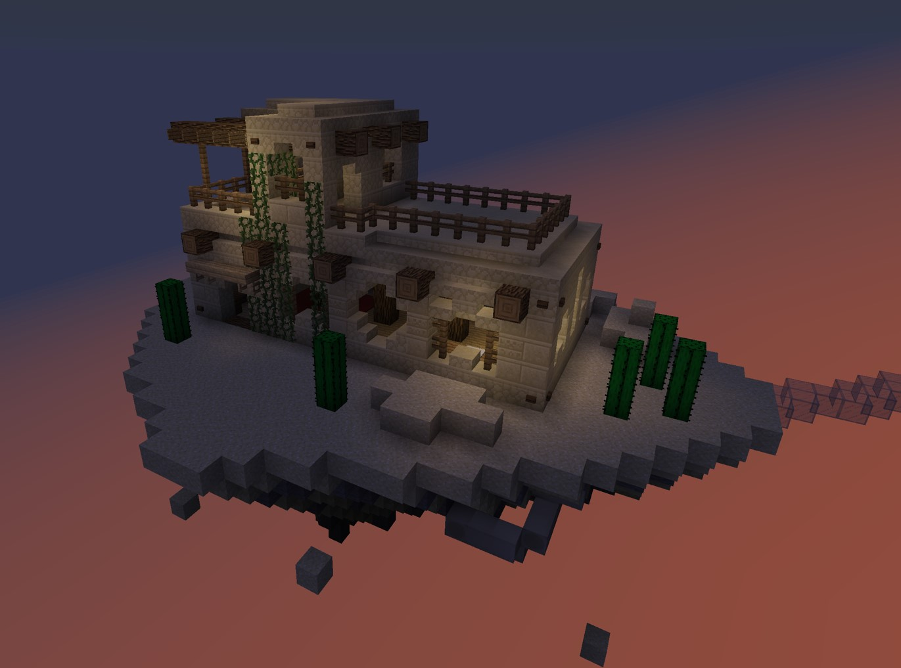
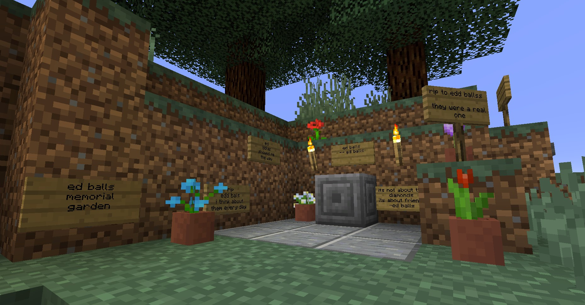

# lightbox


Idk, I needed a really simple lightbox and all the other "simple" lightboxes included way too many features and UI decisions, so I made one myself. Includes keyboard navigation and support for multiple images.

License: WTFPL

## usage

Add `lightbox.css` and `lightbox.js` to the page. Place images inside a `<div>` with the class `.lightbox`.

### single image

```
<div class="lightbox">
  <a href="img/1.jpg">
    
  </a>
</div>
```

### multiple images

```
<div class="lightbox">
  <a href="img/1.jpg"></a>
  <a href="img/2.jpg"></a>
  <a href="img/3.jpg"></a>
</div>
```

Note: images do not have to be in an `<a>` tag linking to the same image, but I recommend doing it this way so users without JavaScript have a fallback.
